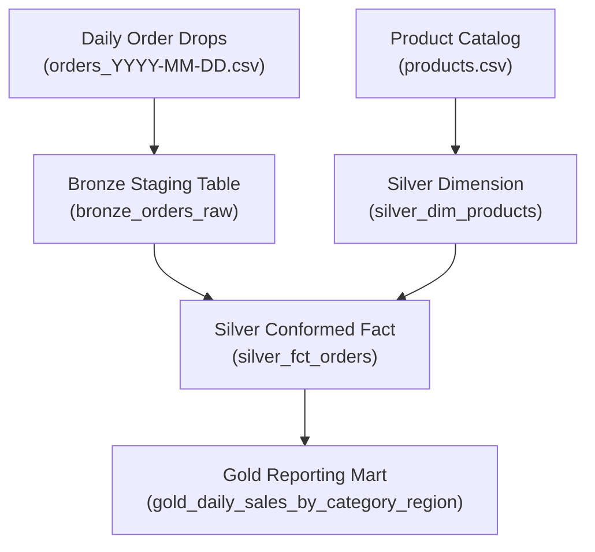

# Engineering Notes & Architecture Design — Retail Data Pipeline

**Candidate:** Igor Ganapolsky  
**Exercise:** Build a Data Pipeline (Retail Daily Order Drops & Product Catalog)  
**Deliverables:** `pipeline.py`, `schema_and_queries.sql`, `output_table.csv`, `output_table.md`, `test_pipeline.py`

---

## 1. Pipeline Architecture & Design (Medallion Pattern)

We implemented a robust **Medallion (Multi-Hop) Architecture** (Bronze ➔ Silver ➔ Gold) designed for repeated daily scheduled execution:



1. **Bronze Layer (`bronze_orders_raw`)**:
   - Append-only raw ingestion log.
   - Captures all raw string inputs exactly as they arrived from upstream systems, plus metadata (`source_file`, `ingested_at`, `extra_data`).
   - Ensures non-destructive ingestion; raw drops can always be re-parsed or replayed.

2. **Silver Layer (`silver_dim_products`, `silver_fct_orders`)**:
   - Cleaned, conformed, typed, and enriched domain tables.
   - Enforces primary key deduplication on `order_id` via **MERGE / Upsert** semantics.
   - Normalizes text casing, dates, currencies, and handles missing price lookups.

3. **Gold Layer (`gold_daily_sales_by_category_region`)**:
   - High-performance analytical reporting mart answering the exact business question:
     - **Grain:** Per `order_date`, `category`, and `region`.
     - **Metrics:** `net_revenue`, `order_count` (distinct orders), `net_units_sold`, `gross_units_sold`, `average_order_value (AOV)`.

---

## 2. Real Data Anomalies Discovered & Engineering Judgments

| Data Issue Identified | Example in Dataset | Engineering Decision & Justification |
| :--- | :--- | :--- |
| **Inconsistent Currency Formatting** | `'$24.99'`, `'$1,099.00'`, `'3.50'` | Robust regex strips currency symbols (`$`, `,`) and converts to 2-decimal floats (`DECIMAL(10,2)` in SQL). |
| **Heterogeneous Date Formats** | `'2024-01-01'` (ISO), `'01/02/2024'` (US), `'1704153600'` (Unix Epoch) | Parser tests multiple datetime formats and 10-digit epoch timestamps, normalizing all to canonical ISO `YYYY-MM-DD`. |
| **Inconsistent String Casing** | Region: `'west'` vs `'West'`; Category: `'electronics'` vs `'Electronics'` | Applied Title Case (`.strip().title()`) across regions and categories to prevent fragmented aggregations. |
| **Missing Unit Price in Orders** | `O2009`: `['O2009', '2024-01-02', 'C019', 'P004', '2', '']` | Imputed missing price from `products.csv` catalog (`P004 Desk Lamp list_price = 29.99`). Preserves transaction value rather than dropping or zeroing out revenue. |
| **Missing Customer IDs** | `O1004`, `O2005` have empty `customer_id` | Stored as `NULL` in Silver. In ecommerce, guest checkouts without user profiles are valid transactions. |
| **Orphan / Unmatched Products** | `P099` (Day 1, `O1007`), `P011` (Day 2, `O2007`) not in `products.csv` | Categorized as `'Unknown'` / `'Uncategorized'` with unit price preserved. **Critical Data Integrity Rule:** Never discard sales dollars due to lagging reference catalogs. |
| **Malformed / Extra CSV Columns** | `O1011` has trailing `'EXTRA_FLAG'` | Sliced and captured in Bronze `extra_data`, while standard positional columns were correctly parsed into Silver. |
| **Truncated Row / Missing Region** | `O2009` has only 6 columns | Missing region defaulted to `'Unknown'` while preserving date, category, and revenue. |
| **CDC Replays & Order Updates** | Day 2 replays `O1002` (exact dupe) and updates `O1003` (qty 5 ➔ 6) | Implemented **MERGE / Upsert on `order_id`**. Replays produce zero net change (idempotent); updates modify the existing record in-place to reflect current state. |
| **Returns / Negative Quantities** | `O2004`: `quantity = -1`, `unit_price = 1099.00` | Processed as a refund: line amount is `-$1,099.00`, reducing `net_revenue`. Handled both `net_units_sold` (-1) and `gross_units_sold` (0) in the schema. |
| **Zero-Quantity Orders** | `O1008`: `quantity = 0` | Processed with `line_amount = $0.00`. Counted as 1 distinct placed order with 0 units. |

---

## 3. Local Implementation vs. Production Databricks / Delta Lake

| Capability | Local Pipeline (`pipeline.py` / SQLite) | Production Databricks / Delta Lake Architecture |
| :--- | :--- | :--- |
| **File Ingestion** | Python `csv` file walker | **Databricks Auto Loader (`cloudFiles`)**: Stream ingestion from S3/ADLS/GCS with automatic file discovery, backpressure, and schema evolution (`cloudFiles.schemaEvolutionMode = "rescue"`). |
| **Bronze Layer** | SQLite append table | **Delta Lake Append Table**: Snappy-compressed Parquet with ACID transaction log (`_delta_log`), time travel, and metadata indexing. |
| **Silver Upserts (CDC)** | `INSERT ... ON CONFLICT(order_id) DO UPDATE` | **Delta `MERGE INTO`**: Distributed ACID upserts matching on `order_id` with `WHEN MATCHED AND source._commit_timestamp >= target._commit_timestamp THEN UPDATE`. |
| **Data Quality Enforcement** | Python validation functions | **Delta Live Tables (DLT) Expectations**: Declarative expectations (e.g. `@dlt.expect_or_drop("valid_date", "order_date IS NOT NULL")`, `@dlt.expect_or_fail("valid_qty", "quantity IS NOT NULL")`). |
| **Gold Reporting Mart** | SQLite SQL View | **Delta Materialized Table / View**: Partitioned by `order_date`, optimized with **Liquid Clustering (`CLUSTER BY (category, region)`)** or Z-Ordering for sub-second query latency in Databricks SQL Serverless. |
| **Change Data Feed (CDF)** | N/A | **Delta CDF enabled (`delta.enableChangeDataFeed = true`)**: Downstream consumers (marketing, finance ERP) consume row-level change streams without full table diffs. |

---

## 4. Databricks PySpark Production Code Implementation

Below is the exact PySpark implementation designed for Databricks Lakehouse:

```python
# Databricks PySpark Production Ingestion & Silver Merge

from pyspark.sql import functions as F
from pyspark.sql.types import *
from delta.tables import DeltaTable

# 1. Bronze: Auto Loader Streaming from Cloud Storage
bronze_stream = (
    spark.readStream
    .format("cloudFiles")
    .option("cloudFiles.format", "csv")
    .option("cloudFiles.schemaLocation", "/mnt/lake/checkpoints/orders_schema")
    .option("cloudFiles.schemaEvolutionMode", "rescue")
    .option("header", "true")
    .load("/mnt/lake/raw/orders/")
    .withColumn("_ingested_at", F.current_timestamp())
    .withColumn("_source_file", F.input_file_name())
)

# Write Bronze stream
(bronze_stream.writeStream
    .format("delta")
    .outputMode("append")
    .option("checkpointLocation", "/mnt/lake/checkpoints/orders_bronze")
    .toTable("bronze.orders_raw"))

# 2. Silver Transformation & Enrichment
def process_silver_microbatch(batch_df, batch_id):
    # Conformed schema cleaning
    cleaned_df = (
        batch_df
        .withColumn("order_id", F.trim(F.col("order_id")))
        .withColumn("order_date", F.coalesce(
            F.to_date(F.col("order_date"), "yyyy-MM-dd"),
            F.to_date(F.col("order_date"), "MM/dd/yyyy"),
            F.to_date(F.from_unixtime(F.col("order_date").cast("long")))
        ))
        .withColumn("quantity", F.coalesce(F.col("quantity").cast("int"), F.lit(0)))
        .withColumn("raw_clean_price", F.regexp_replace(F.col("unit_price"), r"[\$,]", "").cast("decimal(10,2)"))
        .withColumn("region", F.initcap(F.trim(F.coalesce(F.col("region"), F.lit("Unknown")))))
    )

    # Join with Silver Products Dim to impute missing prices & resolve category
    products_dim = spark.table("silver.dim_products")
    
    enriched_df = (
        cleaned_df.join(products_dim, on="product_id", how="left")
        .withColumn("category", F.coalesce(F.col("category"), F.lit("Unknown")))
        .withColumn("unit_price", F.coalesce(F.col("raw_clean_price"), F.col("list_price"), F.lit(0.00)))
        .withColumn("line_amount", (F.col("quantity") * F.col("unit_price")).cast("decimal(12,2)"))
        .withColumn("is_return", F.when(F.col("quantity") < 0, True).otherwise(False))
    )

    # Delta Lake Distributed MERGE
    silver_table = DeltaTable.forName(spark, "silver.fct_orders")
    (
        silver_table.alias("target")
        .merge(
            enriched_df.alias("source"),
            "target.order_id = source.order_id"
        )
        .whenMatchedUpdateAll()
        .whenNotMatchedInsertAll()
        .execute()
    )

# 3. Gold Aggregation Query
gold_df = spark.sql("""
    SELECT
        order_date,
        category,
        region,
        ROUND(SUM(line_amount), 2) AS net_revenue,
        COUNT(DISTINCT order_id) AS order_count,
        SUM(quantity) AS net_units_sold,
        SUM(CASE WHEN quantity > 0 THEN quantity ELSE 0 END) AS gross_units_sold,
        ROUND(SUM(line_amount) / NULLIF(COUNT(DISTINCT order_id), 0), 2) AS average_order_value
    FROM silver.fct_orders
    GROUP BY order_date, category, region
    ORDER BY order_date, category, region
""")
```

---

## 5. Scaling & Enterprise Production Readiness

1. **Volume Scaling (Terabytes/Billions of Rows)**:
   - **Partitioning & Liquid Clustering**: Partition the Silver and Gold tables by `order_date` (or `DATE_TRUNC('month', order_date)` for high-cardinality partitions) and apply Liquid Clustering on `(category, region)`.
   - **Incremental Stateful Aggregations**: Replace full-table group-bys with Delta Live Tables incremental aggregation pipelines using Structured Streaming with watermarking.
2. **Dead Letter Queue (DLQ) & Quarantine Pattern**:
   - Malformed records that fail schema parsing are routed to a `quarantine.orders_corrupt` table with error codes (`INVALID_DATE_FORMAT`, `NEGATIVE_PRICE`) and alerted to on-call data engineers via PagerDuty/Slack webhooks without breaking downstream reporting.
3. **Observability & Data Contracts**:
   - Track data pipeline health metrics: file arrival lag, row count reconciliation (Bronze vs. Silver vs. Gold), duplicate rate, and catalog join hit-rate (monitoring the % of orders falling into `'Unknown'` category).
